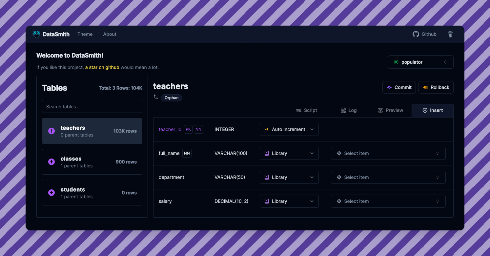

<div align="center">
  
  <h1>DataSmith</h1>
</div>


<p align="center">
  
  
  
  
  
</p>

[](https://www.buymeacoffee.com/mzafarm)

Ever been frustrated with having only limited data to test your applications?
Wished there was a tool that could **quickly generate sample data for your database** minimal hassle?
**Me too. So I built DataSmith.**

DataSmith is a user-friendly evolution of my previous project, [DataForge](https://github.com/MZaFaRM/DataForge), designed to make database population fast and simple.

I'd love to hear any feedback or suggestions!

## Features

- Populate your databases easily with extremely customizable sample data
- Supports `MYSQL`, `POSTGRESQL`, `MSSQL`, `ORACLE`, `MARIADB`, `FIREBIRD`
- Insert data into your database or export its sql query based on custom specifications
- Specify data generation by CONSTANT, NULL, LIBRARY, REGEX, PYTHON and more...

## Setup & Installation

### Installers

* Windows installer: [NSIS](https://github.com/MZaFaRM/DataSmith/releases/latest/download/DataSmith_1.9.0_x64-setup.exe) / [.msi](https://github.com/MZaFaRM/DataSmith/releases/latest/download/DataSmith_1.9.0_x64_en-US.msi).
* Linux builds: [.AppImage](https://github.com/MZaFaRM/DataSmith/releases/latest/download/DataSmith_1.9.0_amd64.AppImage) / [.deb](https://github.com/MZaFaRM/DataSmith/releases/latest/download/DataSmith_1.9.0_amd64.deb) / [.rpm](https://github.com/MZaFaRM/DataSmith/releases/latest/download/DataSmith-1.9.0-1.x86_64.rpm).
* Mac builds: [aarch64 `.dmg`](https://github.com/MZaFaRM/DataSmith/releases/latest/download/DataSmith_1.9.0_aarch64.dmg) / [aarch64 `.app.tar.gz`](https://github.com/MZaFaRM/DataSmith/releases/latest/download/DataSmith_aarch64.app.tar.gz).

### Developer Setup

If you’d like to build it yourself or contribute, follow the instructions below:

### Prerequisites

- Python 3.x
- Node.js (≥ 18)
- pnpm (≥ 8), or npm/yarn
- Rust (stable) + Cargo
- Tauri CLI:

  ```bash
  pnpm add -D @tauri-apps/cli
  ```

### Steps

1. Clone the repository

   ```bash
   git clone https://github.com/MZaFaRM/DataSmith.git
   cd DataSmith
   ```

2. Set up Python backend

   ```bash
   python -m venv venv
   source venv/Scripts/activate  # On Unix: source venv/bin/activate
   pip install -r requirements.txt
   python build.py
   ```

3. Set up the frontend

   ```bash
   pnpm install
   pnpm tauri dev
   ```

4. **Done!**

> Refer to the [Tauri documentation on signing updates](https://v2.tauri.app/plugin/updater/#signing-updates) to resolve signature-related issues during `pnpm tauri build`.

## 🚀 Usage

Boot up the application, connect to a database, and easily start generating and inserting custom data.


---

Drop a ⭐  if you liked this project. 


